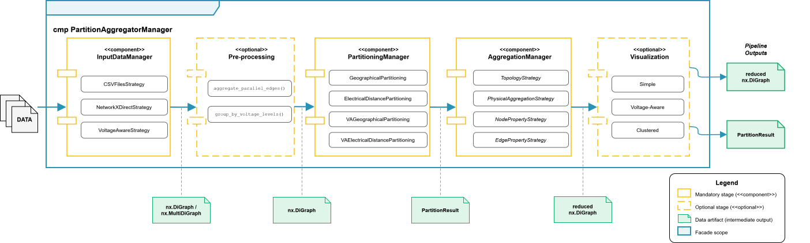
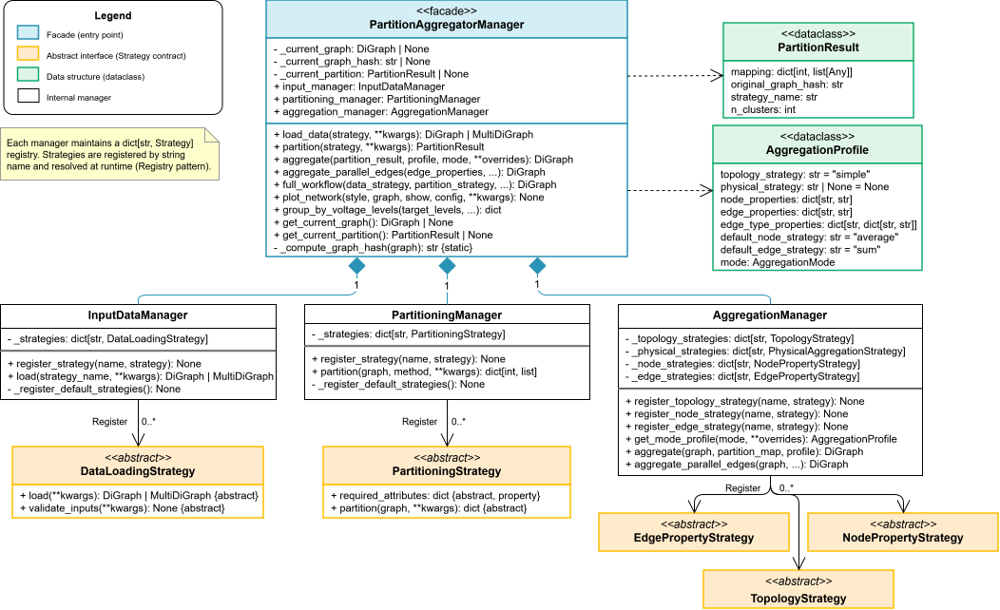

# Summary

NPAP (Network Partitioning and Aggregation Package) is an open-source Python library for reducing
the spatial complexity of network graphs. Built on NetworkX [@NetworkX], it provides an accessible
standalone package designed to be readily integrated with other software and frameworks. Instead of
treating the spatial reduction process as a single action, NPAP explicitly splits it into two
distinct steps: partitioning, which assigns vertices (nodes) to groups (clusters), and aggregation,
which reduces the network based on a given assignment. NPAP’s strategy pattern architecture allows
users to use and register custom partitioning and aggregation strategies seamlessly without
modifying the core code. Currently, NPAP provides 14 different partitioning strategies and two
pre-defined aggregation profiles. Although initially developed with a focus on power systems, its
architecture is general-purpose and applicable to any network graph.

# Statement of need

Real-world electricity grids have grown significantly in size and complexity, potentially spanning
many thousands of nodes and edges. Consequently, energy system optimization models representing
those networks have become computationally intractable and challenging to solve. To regain
tractability and computational efficiency, modelers frequently apply temporal and spatial
aggregation techniques [@Kotzur2021]. Today, temporal complexity reduction, known as time series
aggregation, is a well-established field [@Hoffmann2020;@Teichgraeber2022;@Wogrin2023]. Tools like
tsam (Time Series Aggregation Module) [@Hoffmann2022] have consolidated multiple temporal
aggregation algorithms into a single, reusable Python library that has become a standard component
in many energy system optimization modeling frameworks. Before tsam, modelers implemented these
methods individually and ad hoc for each project, challenging reusability and comparability.

This is exactly where the research on spatial complexity reduction is at: While there is some
research on network partitioning [@frysztacki_comparison_2022] and aggregation
[@colonetti_ward_2025] methods available, there exists no standalone tool that brings all methods
together and is easy to use, extend, and does not rely on framework-specific data structures. NPAP
fills this gap as a standalone package that works with any NetworkX [@NetworkX] graph. The target
audience includes power systems researchers, energy modelers, network analysts, and more broadly,
anyone interested in reducing the spatial complexity of a graph.

# State of the field
Within the energy system optimization community, existing implementations of network partitioning
and aggregation methods are usually tightly rooted to the respective frameworks’ internal data
structure and cannot be reused independently or by other tools and frameworks. The built-in spatial
clustering module of PyPSA [@Brown2018a], for example, provides busmap-based spatial aggregation
using methods such as k-means or hierarchical clustering on geographical coordinates of buses, based
on PyPSA’s `Network` object and `buses` DataFrame. As another example, ETHOS.FINE [@Kluetz2025]
implements spatial reduction through string-, distance-, and parameter-based partitioning modes
[@Patil2022], which are strictly tied to the framework’s internal region-based data model.
Researchers working with other frameworks or custom network representations cannot leverage these
implementations without significant adaptation to the core code structure.

The analogy with temporal complexity reduction and the tsam package [@Hoffmann2022] is instructive.
NPAP extends this paradigm to the spatial dimension. Its unique contributions include:

* Standalone Architecture: A pip-installable library decoupled from any specific energy system modeling framework.
* Extensibility: A strategy pattern architecture that allows new functionalities to be added without
modifying core code.
* Pipeline Control: An explicit conceptual separation between partitioning and aggregation, enabling
rigorous control over each stage of the reduction pipeline.
* Advanced Physical Constraints: Built-in support for voltage-aware and AC-island-aware partitioning
for real-world electricity networks.

# Pipeline architecture

The full NPAP pipeline is shown in Figure \ref{fig:pipeline}. Initially, NPAP performs two stages,
preparing the network graph. In the first stage, data is loaded and a NetworkX graph — used for the
reduction process — is created and validated. In the second stage, NPAP provides optional
pre-processing steps that prepare the network graph for the reduction process. The network can be
illustrated throughout the pipeline using the visualization component.

A key design decision in NPAP is the explicit separation of the network reduction process into
two stages:

1. Partitioning: A partitioning strategy maps each node in the original network to a node in the
   aggregated network. This step only determines group “membership”; it does not modify the graph
   itself.
2. Aggregation: An aggregation strategy reduces the network topology based on a given partitioning
   result (mapping) by aggregating nodes, edges, and their associated properties.

This separation was identified early in the design process as a fundamental distinction. It gives
users fine-grained control: they can swap partitioning algorithms independently of the aggregation
method, apply different aggregation strategies to the same partitioning result, compose custom
pipelines that combine strategies from different domains, or simply use any of them in isolation.
The next section explains the software design in more detail.

# Software design

A broad overview NPAP’s design is shown in Figure \ref{fig:design}. The whole workflow is
orchestrated and accessed by the `PartitionAggregatorManager`. NPAP follows a strategy pattern with
four categories — data loading, partitioning, topology aggregation, and property aggregation — all
orchestrated by three manager classes, shown at the bottom of the Figure. New strategies inherit
from abstract base classes and register with their respective managers, enabling users to seamlessly
add custom strategies without modifying core code. To reduce entry barriers for contributing to
NPAP, the whole library is built on well-established Python packages, such as NetworkX [@NetworkX]
for graph representation, NumPy [@Harris2020], SciPy [@Virtanen2020], and scikit-learn
[@scikit-learn] for numerical computation, and Plotly [@plotly] for interactive map-based
visualization of results. In the following sections, we introduce the loading and pre-processing of
input data, partitioning, and the aggregation processes in more detail.

## Data loading and pre-processing

As NPAP is designed to work with NetworkX graphs, they can be directly passed as input data,
facilitating an easy integration into other frameworks or software. Besides, NPAP currently
supports importing data from CSV files with two main strategies. The first one works with general
node and edge data targeting generic graph structures. The second one is a domain-dependent strategy
focused on power grids and includes buses, lines, transformers, converters, and DC links.
User-specific data loading strategies can be registered straightforward as shown in
Figure \ref{fig:design}. Afterward, optional pre-processing steps are carried out through
the `PartitionAggregatorManager`, such as the aggregation of parallel edges. For power grids,
voltage-level grouping separates the network into independent sub-graphs per voltage level, enabling
voltage-aware partitioning strategies.

## Partitioning strategies
NPAP currently provides four families of partitioning strategies combining geographical and
electricalnode distance with the option of partitioning voltage levels independently
(voltage-awareness). Each family supports 14 different partitioning strategies, such as k-means
[@lloyd1982least], k-medoids [@schubert2021fast], DBSCAN [@ester1996density], HDBSCAN
[@campello2013density], and hierarchical clustering [@ward1963hierarchical]. Geographical distance
captures latitudes and longitudes and is suitable for any geo-referenced network. Electrical
distance computes Power Transfer Distribution Factors (PTDFs) [@wood2012power] to capture the
electrical behavior of a power grid rather than its geographical topology.

In power grids, NPAP automatically detects alternating current (AC) islands linked solely by DC
interconnections and partitions them independently. This, and the voltage-aware partitioning, is
achieved by setting the distance matrix entries of nodes in different AC islands and voltage levels,
respectively, to infinity. Both approaches are algorithm-agnostic, i.e, they work with any
distance-based partitioning method without requiring modifications to the algorithm itself. The
partitioning outcome, along with other metadata, is then stored in the PartitionResult.

## Three-tier aggregation strategy pipeline

The aggregation process is decomposed into three sequential steps. The topology tier builds a new
network graph based on the mapping result of the partitioning process by creating a representative
node for each cluster and adjusting the edges between them accordingly. Afterward, to cover use
cases we do not foresee and usability outside the power system domain, we have included an optional
domain-specific tier. There, users can modify physical properties of the network graph, e.g.,
adding new edges that did not exist in the original graph or explicitly modifying certain
properties, such as line reactances. In the property aggregation tier, user-specified functions,
e.g, sum, average, or equivalent reactances, are then applied to the remaining node and edge
properties. These property aggregation strategies can be configured by the user in detail through
the aggregation profiles shown in Figure \ref{fig:design}. At the moment, NPAP provides two
pre-defined aggregation profiles.

# Research impact statement \label{sec:impact}

NPAP is designed as a standalone, pip-installable open-source Python package, released under the MIT
license. The library is fully documented on ReadTheDocs and includes an automated test suite with
continuous integration across Python 3.10, 3.11, and 3.12. It has been tested on small- and
large-scale networks with up to a few thousand nodes.

One potential application of NPAP is within energy system modeling frameworks. For illustration
purposes, we have integrated it into the well-established PyPSA-Eur [@Hoersch2018] framework through
an open pull request introducing NPAP as an alternative to PyPSA’s native spatial clustering
backend.[^1] Thereby showcasing NPAP’s framework-agnostic design and highlighting the minimal
adoption effort.

[^1]: https://github.com/PyPSA/PyPSA/pull/1568

We further utilized this implementation to demonstrate NPAP’s usability and scalability by applying
it to the full pan-European transmission network [@Xiong2025], comprising around 6800 nodes and
17500 edges. Leveraging the voltage-aware partitioning strategy with geographical distance and
k-means clustering [@lloyd1982least], we analyze the required infrastructure investments for power
lines on different voltage levels and transformers using PyPSA [@Brown2018a]. The work has been
submitted to the International Conference on the European Energy Market 2026.

Active development directions include the extension of the available partitioning strategies, e.g.,
the Adjacent Node Agglomerative Clustering algorithm [@Stoeckl2025a], and aggregation strategies,
e.g., based on PTDFs [@Fortenbacher2018], as well as the extension to other physical
infrastructures, such as hydrogen networks, which require distinct strategies. Future extensions
include, among others, a filtering module that allows selecting subsets of the network, e.g., a
country or region, as an additional pre-processing step before partitioning.

# AI Usage Disclosure

Several artificial intelligence (AI) tools were used during the development of NPAP. Google Gemini
(Pro) was used for non-code-related tasks, such as learning about power systems. Anthropic Claude
(Sonnet 4.5, Opus 4.5, and 4.6), accessed through both the desktop application and the Claude Code
terminal interface, was used for code-related activities, including software design brainstorming,
implementation support, test coverage, or writing the documentation. Grammarly was used for grammar
and spell checking. No other code-generation tools (such as GitHub Copilot, Codex, or Cursor) were
used. All AI-generated output was carefully reviewed, tested, and frequently modified before
inclusion. The authors take full responsibility for the code.

# Acknowledgements

The work done on the package by the contributors of the Institute of Electricity Economics and
Energy Innovation (IEE) at Graz University of Technology was funded by the European Union
(ERC, NetZero-Opt, 101116212). Views and opinions expressed are, however, those of the author(s)
only and do not necessarily reflect those of the European Union or the European Research Council.
Neither the European Union nor the granting authority can be held responsible for them.

# References
